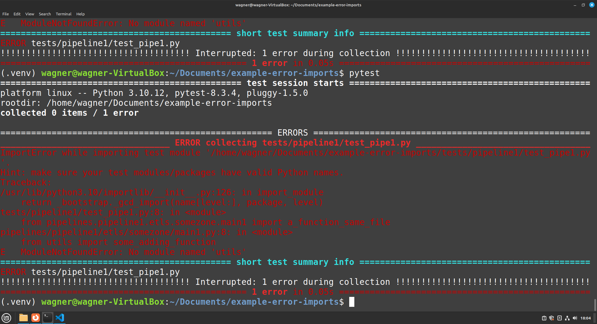
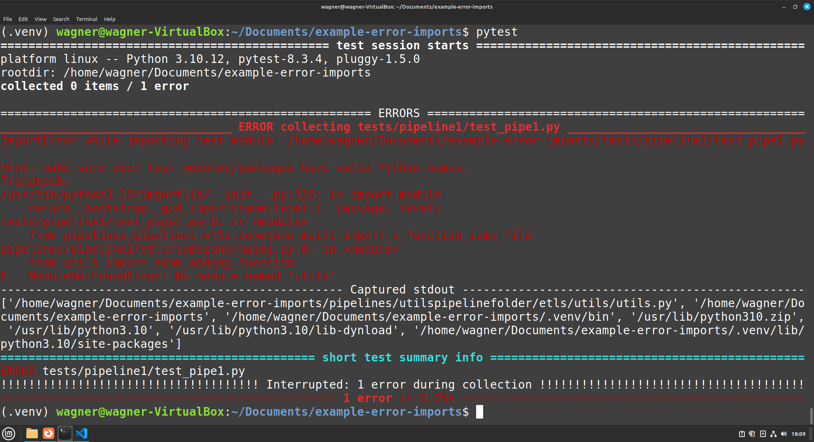

I have written this repository to try to explain the problem that i'm having.


# problem

The tool that i use to run pyspark scripts does not respect folders structure as in the repository. The example of the tool is in the link bellow, it accepts two parameters.

https://github.com/kubeflow/spark-operator/blob/master/docs/api-docs.md#dependencies

Those two parameters are `files`  and `pyfiles` .

The `Files` is the main file of the pipeline, so it behinds the scen runs like this.  
`python3 somescript.py` . And `pyfiles` are scripts that are sent to the "executor" in the same folder as the other files.

So if i configure like

`files="pipeline1/etls/somezone/main1.py", pyfiles="utilspipelinefolder/etls/utils/utils.py` the utils file will be sent to the samefolder as the temporary folder that main1.py was sent.

so in the pod(container) will be created a folder with two scripts.

like this

``` 
├── main1.py
├── utils.py

```

So i can import any function from `utils.py`  in `main.py` using `from utils import some_adding_function` .

The problem is that when i run this with pytest i get a error saying that was unable to found `utils` module. I understand that this is not going to be found to be imported unless i add the `utilspipelinefolder/etls/utils\utils.py` to the pythonpath.

The image of the error is this




Is there anyway that i can add utils folder to the pypath to resolve this kind of error?


i've tried using  a conftest.py with code like this that is on conftest.py in the root folder of the repository. but it did not work

